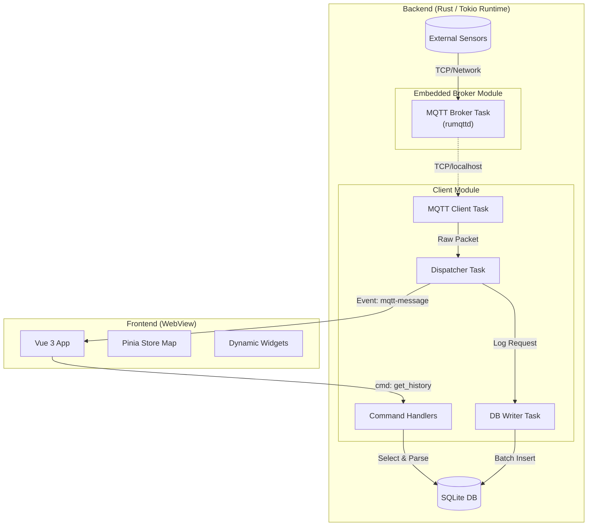

# IoTダッシュボードアプリケーション 詳細設計書 (Detailed Design)

**Version:** 1.1 </br>
**Date:** 2025-12-30 </br>
**Status:** Draft </br>

## 1. システムアーキテクチャ概要

Tauri 2.0を採用し、RustバックエンドとVue 3フロントエンドを疎結合に保つ。
通信（MQTT）と保存（DB）の負荷がUIスレッド（WebView）に影響を与えないよう、Rust側で厳密なスレッド分離（非同期タスク化）を行う。
本バージョンより、内蔵MQTTブローカー機能をサポートする。

### 1.1. 全体構成図



## 2. Backend Design (Rust)

### 2.1. 並行処理モデル
Tokio ランタイム上で以下の主要タスクを独立して稼働させ、mpsc チャネル等で接続する。

#### (1) MQTT Event Loop Task (Client)
**役割:** ブローカーとの接続維持、パケット受信。  

**挙動:** 設定が「Internal Mode」の場合は localhost の内部ブローカーへ、「External Mode」の場合は指定された外部IPへ接続する。

#### (2) Dispatcher Task
**役割:** メッセージのルーティング。  

**処理フロー:**
- 受信データにタイムスタンプ（Rust受信時刻）を付与。
- **To Frontend:** `app.emit` を使用してペイロード（Raw JSON文字列）を全ウィンドウへブロードキャスト。
- **To Database:** DB書き込み用チャネルへメッセージを送信（ノンブロッキング）。

#### (3) DB Writer Task (Batch Insert)
**役割:** SQLiteへの負荷を抑えたバッチ書き込み。  

**バッファリング戦略:**  
内部バッファ `Vec<MqttData>` にデータを蓄積し、100件到達または500ms経過でCOMMITする。

#### (4) MQTT Broker Task (Embedded Broker) [新規追加]
**役割:** MQTTサーバーとして動作し、外部機器および自身のClient Taskからの接続を管理・ルーティングする。  

**起動条件:** 設定ファイルで `connection.mode: "internal"` が選択されている場合のみ起動する。  

**実装:** `rumqttd` ライブラリを使用し、指定ポート（デフォルト: 1883）でTCPリスナーを起動する。

---

### 2.2. データ構造
設定ファイル構造 (layout.json 拡張)  
接続モードを管理するため、設定構造を以下のように定義する。

```rust
struct AppSettings {
    connection: ConnectionSettings,
    retention_days: u32,
    // ... layout settings
}

enum ConnectionMode {
    Internal,
    External,
}

struct ConnectionSettings {
    mode: ConnectionMode,
    internal: InternalConfig, // port, etc.
    external: ExternalConfig, // host, port, credentials
}
```

---

## 3. Database Design (SQLite)

### 3.1. スキーマ定義

基本スキーマをベースに、検索パフォーマンス用のインデックスを追加する。

```sql
CREATE TABLE messages (
    id INTEGER PRIMARY KEY AUTOINCREMENT,
    topic TEXT NOT NULL,
    payload TEXT NOT NULL,
    timestamp INTEGER NOT NULL
);

-- グラフ描画等の範囲検索高速化用
CREATE INDEX idx_topic_timestamp
ON messages (topic, timestamp);
```

### 3.2. データアクセス戦略

#### (1) 履歴データ取得 (Command: `get_history`)

- **間引き (Downsampling):**  
  SQLレベルでの単純間引きを実装し、数万件のデータをUIに渡さない  
  例: `WHERE id % N = 0`（Nは画素数に応じた係数）
- **データ整形:**  
  Rust側でJSONパースを行い、必要な数値のみを抽出してフロントエンドへ返す
- **目的:**  
  フロントエンドでのパース負荷軽減と通信量削減

#### (2) データ保持 (Retention)

- 設定に基づき、定期的に古いデータを削除する  
- **実行タイミング:**  
  - アプリ起動時  
  - 定期実行（バックグラウンドタスク）

---

## 4. Frontend Design (Vue 3 + TypeScript)

### 4.1. Widget System

`layout.json` の構成に基づく動的コンポーネント設計。

- **WidgetHost.vue**
  - `layout.json` の `type` 文字列（例: `"line-chart"`）からコンポーネントを解決
  - 未知の `type` が指定された場合は、「未対応ウィジェット」用のプレースホルダーを表示（エラーで落とさない）

- **設定データの検証**
  - Host側は `props.config` を `any` として受け渡す
  - 各Widget内部（例: `ChartWidget.vue`）で、Zod 等を用いて必要な設定値をバリデーション

### 4.2. State Management (Performance)

#### (1) Store 設計 (`useMqttStore`)

高頻度更新に耐えるため、ディープリアクティブなオブジェクトではなく、フラットな `Map` を使用する。

```ts
// ストアのイメージ
state: () => ({
  // Key: Topic, Value: JSON String
  dataMap: shallowRef(new Map<string, string>())
})
```

#### (2) 更新と描画

- **受信:**  
  `mqtt-message` イベントでRaw JSONを受け取り、StoreのMapを更新
- **描画:**  
  各ウィジェットは `computed` を使い、自身の `config.topic` に対応するMapのエントリだけを監視
- **効果:**  
  無関係なトピックの更新による再レンダリングを防ぐ

### 4.3. 設定ファイル (layout.json)

```json
{
  "meta": {
    "version": "1.1",
    "updatedAt": 1700000000
  },
  "settings": {
    "connection": {
      "mode": "internal",
      "external": {
        "host": "test.mosquitto.org",
        "port": 1883
      },
      "internal": {
        "port": 1883
      }
    },
    "retentionDays": 7
  },
  "layout": [
    {
      "i": "widget_unique_id_1",
      "x": 0, "y": 0, "w": 4, "h": 2,
      "type": "line-chart",
      "config": {
        "topic": "factory/line1/temp",
        "title": "ライン1 温度推移",
        "yAxisMin": 0,
        "yAxisMax": 100
      }
    },
    {
      "i": "widget_unique_id_2",
      "x": 4, "y": 0, "w": 2, "h": 1,
      "type": "toggle-switch",
      "config": {
        "topic": "factory/line1/power",
        "label": "主電源"
      }
    }
  ]
}
```

---

## 5. API Interface (IPC)

### 5.1. Events (Rust -> Frontend)

| Event Name    | Payload Type                                                      | Description                    |
|--------------|-------------------------------------------------------------------|--------------------------------|
| mqtt-message | `{ topic: string, payload: string, timestamp: number }`           | リアルタイム受信データ。payloadはJSON文字列 |

### 5.2. Commands (Frontend -> Rust)

| Command Name      | Arguments                                              | Return Type                    | Description                                                                 |
|-------------------|--------------------------------------------------------|--------------------------------|-----------------------------------------------------------------------------|
| get_history       | `topic: string, start: number, end: number, key: string` | `Vec<{x: number, y: number}>`  | グラフ用履歴データ取得。Rust側でJSON内のkeyの値を取り出して整形する |
| publish_message   | `topic: string, payload: string`                        | `Result<(), String>`           | MQTTメッセージ送信                                                         |

---

## 7. ディレクトリ構成 (directoryStruct.txt)

```plaintext
src-tauri/
├── src/
│   ├── main.rs          // エントリーポイント
│   ├── mqtt.rs          // MQTT通信ロジック (Client: rumqttc)
│   ├── broker.rs        // ★新規: ブローカー起動・設定ロジック (Server: rumqttd)
│   ├── database.rs      // SQLite操作ロジック (rusqlite)
│   └── commands.rs      // フロントエンドから呼ばれる関数群
│
src/ (Frontend)
├── components/
│   ├── dashboard/
│   │   ├── GridContainer.vue  // レイアウト制御
│   │   └── WidgetHost.vue     // 動的コンポーネント読み込み (Factory)
│   └── widgets/
│       ├── ChartWidget.vue
│       ├── GaugeWidget.vue
│       ├── SliderWidget.vue
│       └── ToggleWidget.vue
├── stores/
│   └── useMqttStore.ts  // 最新の計測値を保持
└── types/
    └── widget.ts        // インターフェース定義
```
