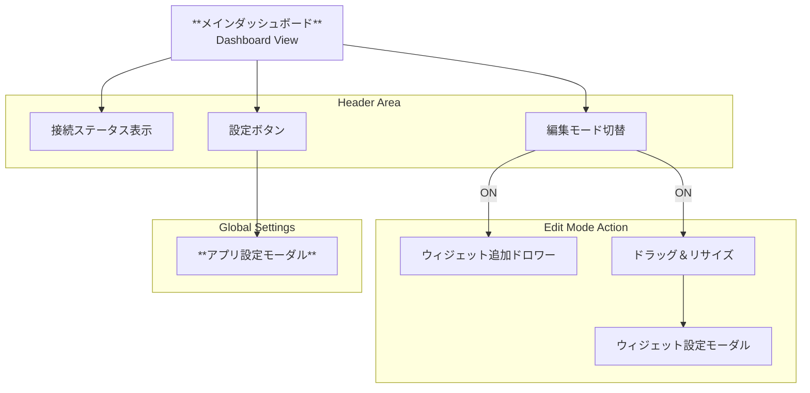

# UI詳細設計書（V1.1 / Draft 1.01 要約統合版）

## 1. 概要
本書は、UI詳細設計書 V1.1 および Draft 1.01 における設計内容を統合・要約したものである。  
産業用アプリケーションとしての **視認性・信頼性・誤操作防止** を重視し、MQTTベースのリアルタイム可視化・制御UIの詳細仕様を定義する。

---

## 2. デザインコンセプト

### 2.1 スタイル
- 基調：**ダークモード**
- 想定利用環境：工場現場ディスプレイ、制御室
- 高コントラスト・長時間視認を前提とした配色

### 2.2 レイアウト
- `grid-layout-plus` を採用
- グリッドベースで、ユーザーが直感的に配置・サイズ変更可能

### 2.3 UIステート
- **閲覧モード（View Mode）**
- **編集モード（Edit Mode）**
- 明確に分離し、誤操作を防止

---

## 3. インタラクションフロー設計

### 3.1 制御フロー（Publish Action）

#### 設計方針（決定事項1：確実性重視）
- UI操作時に状態を即時反映しない
- **MQTTブローカー経由で受信したメッセージのみを正として描画**
- UI表示と実機状態の不整合を防止

#### 基本フロー概要
1. ユーザー操作
2. UIはローディング／無効化表示
3. Backend が MQTT Publish
4. Backend が Subscribe により同メッセージを受信
5. Store 更新
6. UIリアクティブ更新

#### UI実装上の注意
- スピナー表示、半透明化などで操作フィードバックを行う
- 状態確定は必ず受信後

---

## 4. 画面遷移設計

### 4.1 画面遷移方針
- シングルページアプリケーション（SPA）
- 設定はモーダル／ドロワーで完結

### 4.2 画面遷移図（論理構造）


## 5. 画面構成詳細

### 5.1 共通ヘッダー（Global Header）

画面上部に常駐し、アプリ全体の状態管理を行う。

- **左**：アプリロゴ／タイトル  
- **中央**：Connection Status Indicator  
  - 🟢 Connected  
  - 🔴 Disconnected  
  - 🟡 Connecting  
  - Broker情報表示（例: `localhost:1883`）  
- **右**：  
  - Edit Mode Toggle（閲覧／編集切替）  
  - Settings Icon（アプリ全体設定）

---

### 5.2 メインダッシュボード

#### A. 閲覧モード（View Mode）

- ドラッグ・リサイズ無効  
- ウィジェット内部操作のみ有効  
- 背景：ダークグレー単色  

#### B. 編集モード（Edit Mode）

- グリッド線／ドット表示  
- ドラッグ＆ドロップで配置変更  
- 右下ハンドルでリサイズ  
- ウィジェット操作メニュー表示  
  - 🗑️ 削除  
  - ⚙️ 設定  

---

## 6. モーダル・ドロワー設計

### 6.1 アプリ全体設定モーダル（Global Settings）

**Connection**

- Internal / External Broker 切替  
- External：Host / Port（将来 Username / Password）  
- Internal：Port（default 1883）

**Storage**

- Retention Period（日数）  
- Clear Data（DB全消去）

**Appearance**

- テーマ切替（Dark / Light）

---

### 6.2 ウィジェット追加ドロワー（Add Widget Drawer）

- 編集モード時に表示  
- 右端スライド or FAB  
- ドラッグ＆ドロップで追加  

**ウィジェット種別例：**

- 📈 Line Chart  
- ⏱️ Gauge  
- 🔢 Value Display  
- 💡 Lamp  
- 🎚️ Slider  
- 🔘 Button / Toggle  

---

### 6.3 ウィジェット設定モーダル（Widget Config Modal）

**共通項目**

- Title  
- Topic（ワイルドカード不可）

**タイプ別設定例**

- Line Chart：Y軸Min/Max、Line Color  
- Gauge：Min/Max、Unit、Thresholds  
- Slider / Toggle：  
  - Publish Topic  
  - Payload形式（`true/false`, `1/0`, `ON/OFF`）

---

## 7. ウィジェット設定拡張仕様

### 7.1 トピック選択UX（決定事項2）

- 既知トピックを候補表示する Combobox  
- Backendで受信済みトピックを保持  
- 新規トピックの手入力も許可  

### 7.2 JSON Key セレクター（決定事項3）

- JSONペイロード内の特定キーを指定  
- ドット記法対応（例: `data.temp`）  
- 生JSON＋抽出結果のリアルタイムプレビュー  

---

## 8. 設定データ構造

```ts
interface WidgetConfig {
  topic: string;
  title?: string;

  jsonKey?: string;

  style?: {
    color?: string;
    yAxisMin?: number;
    yAxisMax?: number;
    unit?: string;
  };

  control?: {
    publishTopic?: string;
    onValue?: string;
    offValue?: string;
  };
}
## 9. ウィジェットUI仕様

### 9.1 共通仕様

- Loading：`Waiting for data...` / `--`
- Error：通信・パースエラーをアイコン表示

---

### 9.2 各ウィジェット概要

- **Line Chart**：時系列スクロール、Canvas推奨  
- **Gauge**：中央数値表示、閾値で色変化  
- **Value Display**：自動文字サイズ、単位対応  
- **Toggle Switch**：iOS風、操作時にPublish  
- **Slider**：MouseUp時にPublish（連続送信はオプション）
