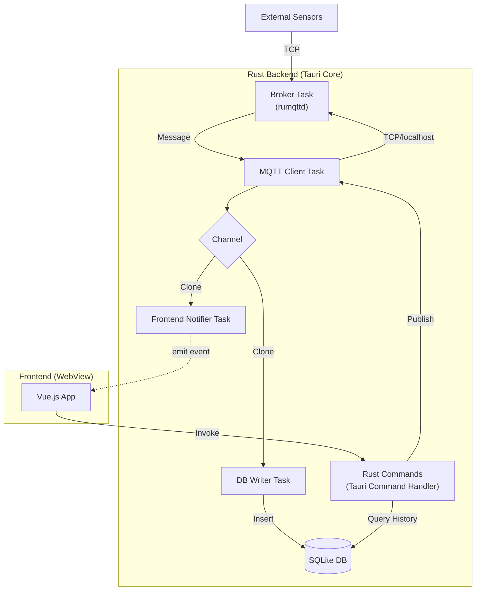

# IoTダッシュボードアプリケーション 開発ドキュメント

## 1. プロジェクト概要

### 1.1. 目的
工場や社内設備などの外部機器とMQTT通信を行い、センサーデータの可視化および機器への制御コマンド送信を行うデスクトップアプリケーションを開発する。
PowerBIのような「データの可視化」機能に加え、ユーザー自身がレイアウトを最適化できる柔軟性を持ち、Pub/Subモデルの採用によって機器側とアプリ側の実装を疎結合に保つことを目的とする。

### 1.2. ターゲットユーザー
* 社内の設備管理者、エンジニア

### 1.3. 動作環境
* **OS:** Windows 10/11
* **プラットフォーム:** デスクトップアプリケーション

---

## 2. 要件定義書 (Requirements Definition)

### 2.1. 機能要件

#### (1) 通信機能 (MQTT)
* **プロトコル:** MQTT v3.1.1 / v5.0
* **Subscribe (受信):**
    * 指定したトピック（ワイルドカード `#`, `+` 対応）のメッセージを受信可能であること。
    * ペイロード形式は原則 **JSON** とする（将来的にバイナリ対応を想定）。
* **Publish (送信):**
    * UI上の操作（ボタン、スライダー等）をトリガーに、指定トピックへ値を送信できること。

#### (2) データの保存・管理
* **履歴保持:** 受信したデータはローカルデータベース (SQLite) に蓄積する。
* **非同期処理:** 通信処理と書き込み処理は分離し、大量受信時もUIや通信をブロックしないこと。
* **データライフサイクル:** データの保持期間（例: 7日間）を設定可能とし、期限切れデータは自動削除する。

#### (3) 可視化・操作機能 (Dashboard)
* **ウィジェットシステム:** 以下のウィジェットを利用可能とする。
    * **表示系:** ゲージ、数値表示、折れ線グラフ（リアルタイム更新）、ランプ（ステータス表示）。
    * **入力系:** スライダー、トグルスイッチ、テキスト入力、ボタン。
* **個人最適化:**
    * グリッドレイアウトシステムを採用し、ユーザーがウィジェットの配置・サイズをドラッグ＆ドロップで変更可能とする。
* **設定保存:**
    * ダッシュボードのレイアウト設定および各ウィジェットのパラメータ（トピック名、閾値など）は、JSONファイルとしてローカルに保存・読み込み可能とする。

#### (4) MQTTブローカー機能 (Embedded Broker) 
* **サーバー機能:** アプリケーション起動時に、ローカルネットワーク内で機能するMQTTブローカーを立ち上げる機能を有する。
    * 他のIoT機器からの接続を受け付ける（TCP接続）。
* **モード切替:** 設定により「外部ブローカーに接続するモード（Client Mode）」と「自身がブローカーとなるモード（Broker Mode）」を切り替え可能とする。
* **設定項目:** ブローカーモード時は、リッスンするポート番号（デフォルト: 1883）を設定可能とする。
* **制約:** 認証機能（ユーザー名/パスワード）は初期リリースでは簡易的なもの（Allow Anonymous）とする。

### 2.2. 非機能要件
* **拡張性:** 将来的に新しいウィジェットを追加する際、既存コードへの影響を最小限に抑える設計（Factoryパターン等）とする。
* **パフォーマンス:** グラフ描画において、数千件のデータポイントを扱ってもフリーズしないこと。

---

## 3. 基本設計書 (Basic Design)

### 3.1. 技術スタック選定

| カテゴリ | 技術要素 | 選定理由 |
| :--- | :--- | :--- |
| **App Shell** | Tauri 2.0 | 軽量性、OSネイティブ機能へのアクセス、Rustバックエンドとの統合 |
| **Backend** | Rust | メモリ安全性、並行処理性能（Tokio）、堅牢なMQTTクライアント実装 |
| **Frontend** | TypeScript + Vue 3 | Composition APIによる高い開発効率とパフォーマンス |
| **State Mng** | Pinia | センサーデータとアプリ設定の一元管理 |
| **UI Library** | Tailwind CSS (任意) | スタイリング効率化 |
| **Grid Sys** | grid-layout-plus | Vue 3対応のドラッグ＆ドロップグリッドシステム |
| **Chart** | ECharts | 大量データの高速描画、産業向けデザインの豊富さ |
| **Database** | SQLite (rusqlite) | ローカル完結の軽量RDB、Tauriとの親和性 |
| **Client** | MQTT (rumqttc) | Rust製の軽量・非同期MQTTクライアント |
| **Broker** | **rumqttd** | **Rust製の組み込み可能なMQTTブローカー。Tauriアプリの一部として動作可能。** [新規追加] |

### 3.2. システムアーキテクチャ
Rustバックエンドにて「通信」「DB保存」「フロントエンド通知」に加え、「ブローカー機能」をスレッド分離し、連携する。

